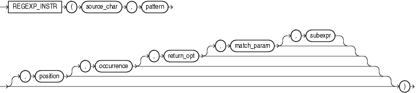

# REGEXP_INSTR

## 语法



=== "用途"
    !!! note "用途"

        `regexp_instr` 函数允许您在字符串中搜索正则表达式模式来扩展 `instr` 函数的功能。该函数使用输入字符集定义的字符来评估字符串。它返回一个整数, 表示匹配子字符串的开始位置或结束位置, 具体取决于 `return_option` 参数的值。如果未找到匹配, 则函数返回 0。

=== "参数说明"
    !!! abstract annotate "参数"

        - `source_char` 是字符表达式, 用作搜索值。
        - `pattern` 是正则表达式。通常是一个文本字面量。
        - `position` 是一个正整数, 指示 Oracle 应开始搜索 `source_char` 的字符位置。默认值为 1。
        - `occurrence` 是一个正整数, 指示 Oracle 应在 `source_char` 中搜索 `pattern` 的第几次出现。默认值为 1, 表示 Oracle 搜索 `pattern` 的第一次出现。如果 `occurrence` 大于 1, 则数据库会从第一个 `pattern` 匹配之后的第一个字符开始搜索第二次出现, 依此类推。
        - `return_option` 允许您指定 Oracle 应该返回与出现相关的内容。 (1)
        - `match_param` 指定匹配规则。 此参数对此函数的行为与 [`REGEXP_COUNT`](./REGEXP_COUNT.md) 中的行为相同。
        - 对于具有子表达式的 `pattern`, `subexpr` 是一个介于 0 到 9 之间的整数, 指示 `pattern` 中作为函数目标的子表达式。 `subexpr` 是由圆括号括起来的 `pattern` 片段。子表达式可以嵌套。子表达式按它们的左括号在 `pattern` 中出现的顺序进行编号。 (2)
    
    1.  - 如果指定 0, 则 Oracle 返回出现的第一个字符的位置。这是默认值。
        - 如果指定 1, 则 Oracle 返回出现之后的字符的位置。
    2.  例如, 考虑以下表达式:
        ```
        0123(((abc)(de)f)ghi)45(678)
        ```
        此表达式具有以下顺序的 5 个子表达式: “abcdefghi”,“abcdef”,“abc”,“de”和“678”。
        - 如果 `subexpr` 为零, 则返回与 `pattern` 匹配的整个子字符串的位置。
        - 如果 `subexpr` 大于零, 则返回与 `pattern` 中编号为 `subexpr` 的子表达式对应的子字符串片段在匹配子字符串中的位置。
        - 如果 `pattern` 没有至少 `subexpr` 个子表达式, 则函数返回零。
        - 空 `subexpr` 值返回 `NULL`。
        - `subexpr` 的默认值为零。


## 示例

从字符串中的第一个字符开始搜索, 并返回找到的第六次出现一个或多个非空格字符的起始位置。

```sql
select regexp_instr('500 Oracle Parkway, Redwood Shores, CA',
                    '[^ ]+', 1, 6) REGEXP_INSTR
from dual; -- (1)!
```

1.  !!! quote ""
        REGEXP_INSTR
        ------------
                  37


从字符串的第三个字符开始搜索, 并返回字符串中第二个出现的以 `s`、`r` 或 `p` 开头的七个字母的单词之前/后的位置。

```sql
select regexp_instr('500 Oracle Parkway, Redwood Shores, CA',
                    '[s|r|p][[:alpha:]]{6}', 3, 2, 0, 'i') REGEXP_INSTR1
     , regexp_instr('500 Oracle Parkway, Redwood Shores, CA',
                    '[s|r|p][[:alpha:]]{6}', 3, 2, 1, 'i') REGEXP_INSTR2
from dual; -- (1)!
```

1.  !!! quote ""
        REGEXP_INSTR1 REGEXP_INSTR2
        ------------- -------------
                   21            28


使用 `subexpr` 参数在 `pattern` 中搜索特定的子表达式。第一个语句返回源字符串中第一个子表达式的第三个字符的位置, 即 '56':

```sql
select regexp_instr('1234567890', '(123)(4(56)(78))',
                    1, 1, 0, 'i', 3) REGEXP_INSTR
from dual; -- (1)!
```

1.  !!! quote ""
        REGEXP_INSTR
        ------------
                   5


查询邮箱列并搜索有效的邮箱地址:

```sql
select regexp_instr('johndoe@example', '\w+@\w+(\.\w+)+')     IS_A_VALID_EMAIL
     , regexp_instr('johndoe@example.com', '\w+@\w+(\.\w+)+') IS_A_VALID_EMAIL
from regexp_temp; -- (1)!
```

1.  !!! quote ""
        IS_A_VALID_EMAIL IS_A_VALID_EMAIL
        ---------------- ----------------
                       0                1

