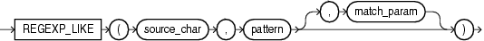

# REGEXP_LIKE

## 语法



=== "用途"
    !!! note "用途"
    
        `regexp_like` 与 `like` 条件类似, 但是 `regexp_like` 执行正则表达式匹配而不是 `like` 执行的简单模式匹配。 此条件使用输入字符集定义的字符来评估字符串。

=== "参数说明" 
    !!! abstract annotate "参数"

        - `source_char` 是用作搜索值的字符表达式，通常是一个字符列。 
        - `pattern` 是正则表达式，通常是一个文本字面量。
        - `match_param` 指定匹配规则。 (1)  
    
    1.  `match_param` 的值可以包含以下一个或多个字符:
        - `'i'` 指定不区分大小写的匹配。
        - `'c'` 指定区分大小写和重音符号的匹配。
        - `'n'` 允许句点(.)这个通配符匹配换行符。
        - `'m'` 将源字符串视为多行。
        - `'x'` 忽略空白字符。
        如果 `match_param` 的值包含多个相互矛盾的字符, 则 Oracle 使用最后一个字符。
        如果省略 `match_param`, 则:
        > 默认的大小写敏感性和重音符敏感性由 `pattern` 决定。<br>
        > 句点(.)不匹配换行符。<br>
        > 源字符串被视为单行。

## 示例

返回第一个名字为 Steven 或 Stephen(其中 `first_name` 以 `Ste` 开头并以 `en` 结尾, 中间是 `v` 或 `ph`)的员工的名字和姓:

```sql
select first_name, last_name
from employees
where regexp_like(first_name, '^Ste(v|ph)en$')  
order by first_name, last_name; -- (1)!
```

1.  !!! quote ""
        FIRST_NAME           LAST_NAME
        -------------------- -------------------------
        Stephen              Stiles
        Steven               King
        Steven               Markle


返回姓中包含两个相邻的 `a`、`e`、`i`、`o` 或 `u` 的员工的姓(不区分大小写):

```sql
select last_name   
from employees
where regexp_like(last_name, '([aeiou])\1')
order by last_name; -- (1)!
```

1.  !!! quote ""
        LAST_NAME
        -------------------------
        Bloom
        De Haan
        Feeney
        Gee
        Greenberg
        Greene
        Khoo
        Lee
