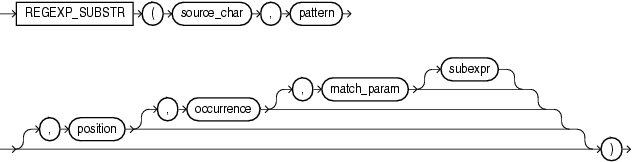

# REGEXP_SUBSTR

## 语法



=== "用途"
    !!! note "用途"

        `REGEXP_SUBSTR` 通过允许您在字符串中搜索正则表达式模式来扩展 `SUBSTR` 函数的功能。它与 `REGEXP_INSTR` 类似, 但是它返回匹配子字符串本身, 而不是返回子字符串的位置。

=== "参数说明"
    !!! abstract annotate "参数"

        - `source_char` 是字符表达式, 用作搜索值。
        - `pattern` 是正则表达式。它通常是一个文本字面量。
        - `position` 是一个正整数, 指示 Oracle 应开始搜索 `source_char` 的字符位置。默认值为 1。
        - `occurrence` 是一个正整数, 指示 Oracle 应在 `source_char` 中搜索 `pattern` 的第几次出现。默认值为 1。 (1)
        - `match_param` 是 `VARCHAR2` 或 `CHAR` 数据类型的字符表达式, 它允许您更改函数的默认匹配行为。
        - 对于具有子表达式的 `pattern`, `subexpr` 是一个非负整数, 范围从 0 到 9, 用于指示函数应返回 `pattern` 中的哪个子表达式。
      
    1.  如果 `occurrence` 大于 1, 则数据库会从第一个 `pattern` 匹配之后的第一个字符开始搜索第二次出现, 依此类推。


## 示例 

搜索以逗号开头后跟一个或多个非逗号字符最后以逗号结尾的字符串。

```sql
select regexp_substr('500 Oracle Parkway, Redwood Shores, CA',
                     ',[^,]+,') REGEXPR_SUBSTR
from dual; -- (1)!
```

1.  !!! quote ""
        REGEXPR_SUBSTR
        -----------------
        , Redwood Shores,


在 `http://` 和斜杠 (`/`) 或字符串末尾之间搜索此子字符串的最小 3 次和最大 4 次出现。

```sql
select regexp_substr('http://www.example.com/products',
                     'http://([[:alnum:]]+\.?){3,4}/?') REGEXP_SUBSTR
from dual; -- (1)!
```

1.  !!! quote ""
        ----------------------
        http://www.example.com/


返回 `pattern` 中的第四个子表达式:

```sql 
select regexp_substr('1234567890', '(123)(4(56)(78))',
                     1, 1, 'i', 4) REGEXP_SUBSTR
from dual; -- (1)!
```

1.  !!! quote ""
        REGEXP_SUBSTR
        -------------------
        78


从字符串中提取数字和字母:

```sql
with strings as (
    select 'ABC123' str from dual union all
    select 'A1B2C3' str from dual union all
    select '123ABC' str from dual union all
    select '1A2B3C' str from dual   
)
select regexp_substr(str, '[0-9]')      First_Occurrence_of_Number
     , regexp_substr(str, '[0-9].*')    Num_Followed_by_String
     , regexp_substr(str, '[A-Z][0-9]') Letter_Followed_by_String
from strings; -- (1)!
```

1.  !!! quote ""
        FIRST_OCCURRENCE_OF_NUMB NUM_FOLLOWED_BY_STRING   LETTER_FOLLOWED_BY_STRIN
        ------------------------ ------------------------ ------------------------
        1			                      123			                   C1
        1			                      1B2C3			                   A1
        1			                      123ABC
        1			                      1A2B3C 		                   A2


截取 HTML 第一个标签中的内容:

```sql
select regexp_substr('<h1>RegexLean</h1>',
                    '<(\w+)>(.*)</\1>', 1, 1, 'i', 2) STR
from dual; -- (1)!
```

1.  !!! quote ""
        STR
        ---------
        RegexLean


获取 tmp_area 表中的市级区域和最小的区域:

```sql
with tmp_area as (
        select '贵州省-安顺市-西秀区-大西桥镇' area from dual union all 
        select '广东省-深圳市-龙岗区' area from dual union all 
        select '内蒙古-呼和浩特市' area from dual
)
select regexp_substr(area, '[^-]+', 1, 2)                           CITY_AREA
     , regexp_substr(area, '[^-]+', 1, regexp_count(area, '[^-]+')) MIN_AREA1
     , regexp_replace(area, '.*-(.*)', '\1')                        MIN_AREA2
from tmp_area; -- (1)!
```

1.  !!! quote ""
        CITY_AREA                   MIN_AREA1                   MIN_AREA2
        --------------------------- --------------------------- ---------------------------
        安顺市                       大西桥镇                     大西桥镇
        深圳市                       龙岗区                       龙岗区
        呼和浩特市                   呼和浩特市                    呼和浩特市