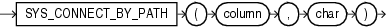

# SYS_CONNECT_BY_PATH

## 语法



!!! note "用途"
    `SYS_CONNECT_BY_PATH` 仅在层次查询中有效。它返回从根到节点的列值路径, 用 `char` 为每个由 `CONNECT BY` 条件返回的行分隔列值。`column` 和 `char` 都可以是任何数据类型。


## 示例

返回从员工 `Kochhar` 到所有 `Kochhar` 的员工(及其员工)的员工姓名路径:

```sql
select LPAD(' ', 2 * level - 1) || sys_connect_by_path(last_name, '/') "Path"
from employees 
start with last_name = 'Kochhar'
connect by prior employee_id = manager_id;

Path
------------------------------
     /Kochhar/Greenberg/Chen
     /Kochhar/Greenberg/Faviet
     /Kochhar/Greenberg/Popp
     /Kochhar/Greenberg/Sciarra
     /Kochhar/Greenberg/Urman
     /Kochhar/Higgins/Gietz
   /Kochhar/Baer
   /Kochhar/Greenberg
   /Kochhar/Higgins
   /Kochhar/Mavris
   /Kochhar/Whalen
 /Kochhar
```

 