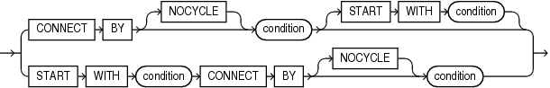
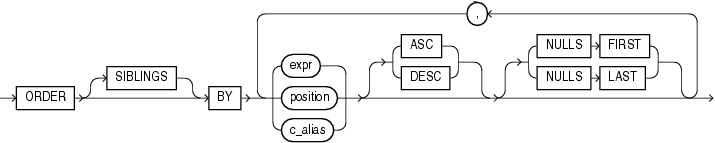

# 层次查询

## 语法



!!! abstract annotate 

    - `condition` 可以是任何条件。
    - `START WITH` 指定层次结构的根行。
    - `CONNECT BY` 指定父行和子行之间的关系。
    - `NOCYCLE` 参数指示 Oracle 数据库即使数据中存在 `CONNECT BY` 循环也返回行。将此参数与 [`CONNECT_BY_ISCYCLE`](./Hierarchical_Query_Pseudocolumns.md#connect_by_iscycle-伪列) 伪列一起使用, 以查看包含循环的行。
    - 在层次查询中, `condition` 中的一个表达式必须使用 `PRIOR` 运算符限定, 以引用父行。例如:
    
      ```sql
      ... PRIOR expr = expr
      或
      ... expr = PRIOR expr
      ```
      
    - `PRIOR` 是一元运算符, 与一元 + 和 - 算术运算符具有相同的优先级。它对层次查询中当前行的父行求值紧跟其后的表达式。
  
        > `PRIOR` 最常用于将列值与相等运算符进行比较。

        > `PRIOR` 关键字可以在运算符的任一侧，**prior 在哪一侧，就是向哪一侧递归查询。**

    


### Oracle 处理层次查询

- 首先评估联接(如果存在), 无论联接是在 `FROM` 子句中指定还是用 `WHERE` 子句谓词指定。
- 评估 `CONNECT BY` 条件。 
- 评估任何其余的 `WHERE` 子句谓词。

???+ quote "形成层次结构的步骤"

     1. Oracle 选择层次结构的根行, 即满足 `START WITH` 条件的行。
     2. Oracle 选择每个根行的子行。每个子行必须满足与其中一个根行相关的 `CONNECT BY` 条件。
     3. Oracle 选择后代子行的后续代。Oracle 首先选择步骤 [2] 中返回的行的子行, 然后是这些子行的子行, 依此类推。Oracle 始终通过评估与当前父行相关的 `CONNECT BY` 条件来选择子行。
     4. 如果查询包含没有联接的 `WHERE` 子句, 则 Oracle 从层次结构中删除不满足 `WHERE` 子句条件的所有行。Oracle 对每行单独评估此条件, 而不是删除不满足条件的行的所有子行。
     5. Oracle 以下图所示的顺序返回行。在图中, 子项出现在其父项下方。
    
    

要查找父行的子行, Oracle 会对父行的 `PRIOR` 表达式进行求值, 并对表中的每一行求值 `CONNECT BY` 条件中的其他表达式。条件为真的行是父行的子行。`CONNECT BY` 条件可以包含其他条件来进一步过滤查询选择的行。

如果 `CONNECT BY` 条件导致层次结构中的循环, 则 Oracle 返回错误。如果一行既是另一行的父行(或祖父行或直接祖先)也是其子行(或孙行或直接后代), 则会发生循环。

!!! warning annotate 
    在层次查询中, 指定 `ORDER BY` 或 `GROUP BY` 会覆盖 `CONNECT BY` 结果的层次顺序。如果要对具有相同父级的同级行进行排序, 请使用 `ORDER SIBLINGS BY` 子句。 (1)

1.  *order_by_clause*::=
    


## 示例

CONNECT BY 示例

使用 `CONNECT BY` 子句定义员工和管理者之间的关系:

```sql
select employee_id, last_name, manager_id
from employees 
connect by prior employee_id = manager_id;
  
EMPLOYEE_ID LAST_NAME                 MANAGER_ID
----------- ------------------------- ----------
        101 Kochhar                          100
        108 Greenberg                        101
        109 Faviet                           108
        110 Chen                             108
        111 Sciarra                          108
        112 Urman                            108
        113 Popp                             108
        200 Whalen                           101
        203 Mavris                           101
        204 Baer                             101
. . .
```

### LEVEL 示例 

使用 `LEVEL` 伪列显示父行和子行:

```sql  
select employee_id, last_name, manager_id, level
from employees 
connect by prior employee_id = manager_id;
  
EMPLOYEE_ID LAST_NAME                 MANAGER_ID      LEVEL
----------- ------------------------- ---------- ----------
        101 Kochhar                          100          1
        108 Greenberg                        101          2
        109 Faviet                           108          3
        110 Chen                             108          3
        111 Sciarra                          108          3
        112 Urman                            108          3
        113 Popp                             108          3
        200 Whalen                           101          2
        203 Mavris                           101          2
        204 Baer                             101          2
        205 Higgins                          101          2
        206 Gietz                            205          3
        102 De Haan                          100          1
```

### START WITH 示例

添加 `START WITH` 子句以指定层次结构的根行, 并使用 `SIBLINGS` 关键字的 `ORDER BY` 子句在层次结构内保留排序:

```sql
select last_name, employee_id, manager_id, level
from employees
start with employee_id = 100
connect by prior employee_id = manager_id
order siblings by last_name;
  
LAST_NAME                 EMPLOYEE_ID MANAGER_ID      LEVEL
------------------------- ----------- ---------- ----------
King                              100                     1
Cambrault                         148        100          2
Bates                             172        148          3
Bloom                             169        148          3
Fox                               170        148          3
Kumar                             173        148          3
Ozer                              168        148          3
Smith                             171        148          3
De Haan                           102        100          2
Hunold                            103        102          3
Austin                            105        103          4
Ernst                             104        103          4
Lorentz                           107        103          4
Pataballa                         106        103          4
Errazuriz                         147        100          2
Ande                              166        147          3
Banda                             167        147          3
```

在 `hr.employees` 表中, 员工 Steven King 是公司的负责人, 没有经理。他的员工中有 John Russell, Russell 是部门 80 的经理。如果将 Russell 设置为 King 的经理更新 `employees` 表, 将在数据中创建一个循环:

```sql
update employees
set manager_id = 145
where employee_id = 100;

select last_name                           "Employee"
     , level
     , sys_connect_by_path(last_name, '/') "Path"
from employees
where level <= 3 and department_id = 80
start with last_name = 'King'
connect by prior employee_id = manager_id and level <= 4;
  
ERROR:
ORA-01436: CONNECT BY loop in user data
```

`CONNECT BY` 条件中的 `NOCYCLE` 参数会导致 Oracle 尽管循环仍返回行。`CONNECT_BY_ISCYCLE` 伪列向您显示哪些行包含循环:

```sql
select last_name                           "Employee"
     , connect_by_iscycle                  "Cycle"
     , level
     , sys_connect_by_path(last_name, '/') "Path"
from employees
where level <= 3 and department_id = 80
start with last_name = 'King'
connect by NOCYCLE prior employee_id = manager_id and level <= 4
order by "Employee", "Cycle", level, "Path";
  

Employee                       Cycle      LEVEL Path
------------------------- ---------- ---------- -------------------------
Abel                               0          3 /King/Zlotkey/Abel
Ande                               0          3 /King/Errazuriz/Ande
Banda                              0          3 /King/Errazuriz/Banda
Bates                              0          3 /King/Cambrault/Bates
Bernstein                          0          3 /King/Russell/Bernstein
Bloom                              0          3 /King/Cambrault/Bloom
Cambrault                          0          2 /King/Cambrault
Cambrault                          0          3 /King/Russell/Cambrault
Doran                              0          3 /King/Partners/Doran
Errazuriz                          0          2 /King/Errazuriz
Fox                                0          3 /King/Cambrault/Fox
...
```

### CONNECT_BY_ISLEAF 示例

使用层次查询将列的值转换为逗号分隔列表:

```sql
select ltrim(sys_connect_by_path(warehouse_id,','),',') 
from
  (select rownum r, warehouse_id from warehouses)
where connect_by_isleaf = 1
start with r = 1
connect by r = prior r + 1
order by warehouse_id;
  
LTRIM(SYS_CONNECT_BY_PATH(WAREHOUSE_ID,','),',')
--------------------------------------------------------------------------------
1,2,3,4,5,6,7,8,9
```

### CONNECT_BY_ROOT 示例

返回部门 110 中每个员工的姓、该员工在层次结构中高于其的最高级经理的姓、经理和员工之间的级别数, 以及它们之间的路径:

```sql 
select last_name                           "Employee"
     , connect_by_root last_name           "Manager"
     , level - 1 "Pathlen"
     , sys_connect_by_path(last_name, '/') "Path"
from employees
where level > 1 and department_id = 110 
connect by prior employee_id = manager_id
order by "Employee", "Manager", "Pathlen", "Path";
  
Employee        Manager            Pathlen Path
--------------- --------------- ---------- ------------------------------
Gietz           Higgins                  1 /Higgins/Gietz
Gietz           King                     3 /King/Kochhar/Higgins/Gietz
Gietz           Kochhar                  2 /Kochhar/Higgins/Gietz
Higgins         King                     2 /King/Kochhar/Higgins
Higgins         Kochhar                  1 /Kochhar/Higgins
```

使用 `GROUP BY` 子句返回部门 110 中每个员工及层次结构中高于该员工的所有员工的总薪水:

```sql
select name
     , sum(salary) "Total_Salary"
from 
    (select connect_by_root last_name name
          , Salary
    from employees
    where department_id = 110 
    connect by prior employee_id = manager_id)
group by name
order by name, "Total_Salary";
  
NAME                      Total_Salary
------------------------- ------------
Gietz                             8300
Higgins                          20300
King                             20300
Kochhar                          20300
```

