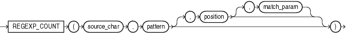

# REGEXP_COUNT

## 语法



=== "用途"
    !!! note annotate "用途"

        `regexp_count` 函数补充了 [regexp_instr](./REGEXP_INSTR.md) 函数的功能, 它返回模式在源字符串中出现的次数。该函数使用字符集定义的字符来评估字符串。它返回一个整数, 表示 `pattern` 出现的次数。如果未找到匹配, 则该函数返回 0。 (1)
    
    1.  `regexp_count` 忽略 `pattern` 中的子表达式括号。


=== "参数说明"
    !!! abstract annotate "参数"

        - `source_char` 是用作搜索值的字符表达式，通常是一个字符列。 
        - `pattern` 是正则表达式，通常是一个文本字面量。
        - `position` 是一个正整数, 指示 Oracle 应开始搜索 `source_char` 的字符位置。默认为 1。 
        - `match_param` 指定匹配规则。 (1)  
    
    1.  `match_param` 的值可以包含以下一个或多个字符:
        - `'i'` 指定不区分大小写的匹配。
        - `'c'` 指定区分大小写和重音符号的匹配。
        - `'n'` 允许句点(.)这个通配符匹配换行符。
        - `'m'` 将源字符串视为多行。
        - `'x'` 忽略空白字符。
        如果 `match_param` 的值包含多个相互矛盾的字符, 则 Oracle 使用最后一个字符。
        如果省略 `match_param`, 则:
        > 默认的大小写敏感性和重音符敏感性由 `pattern` 决定。<br>
        > 句点(.)不匹配换行符。<br>
        > 源字符串被视为单行。


## 示例

验证提供的字符串是否符合给定的模式, 并返回匹配的数量:

```sql
select regexp_count('ABC123', '[A-Z]') Match1
     , regexp_count('A1B2C3', '\w+') Match2
from dual; -- (1)!
```

1.  !!! quote ""
            MATCH1     MATCH2
        ---------- ----------
                 3          1


从第三个字符开始评估源字符串, 跳过了第一个模式的出现:

```sql
select regexp_count('abcabcABCABC', 'A', 3, 'i') MATCH1 
     , regexp_count('abcabcABCABC', 'A', 3, 'c') MATCH2
from dual; -- (1)!
```

1.  !!! quote ""
            MATCH1     MATCH2
        ---------- ----------
                 3          2


模式中的子表达式括号会被忽略:

```sql 
select regexp_count('abcabcabcabcabc', '(ab)c') REGEXP_COUNT
from dual; -- (1)! 
```

1.  !!! quote ""
        REGEXP_COUNT
        ------------
                   5


验证提供的字符串是否符合给定的模式, 并返回字母字符后跟单个数字的数量: 

```sql
select regexp_count('ABC123', '[A-Z][0-9]') Match1
     , regexp_count('A1B2C3', '[A-Z][0-9]') Match2
from dual; -- (1)!
```

1.  !!! quote ""
            MATCH1     MATCH2
        ---------- ----------
                 1          3


验证提供的字符串是否符合给定的模式, 并返回仅在字符串开头的字母字符后跟单个数字的数量:

```sql
select regexp_count('ABC123', '^[A-Z][0-9]') MATCH1
     , regexp_count('A1B2C3', '^[A-Z][0-9]') MATCH2
from dual; -- (1)!
```

1.  !!! quote ""
            MATCH1     MATCH2
        ---------- ----------
                 0          1


验证提供的字符串是否符合给定的模式, 并返回仅包含在字符串中的字母字符后跟两个数字的数量:

```sql  
select regexp_count('ABC123', '[A-Z][0-9]{2}') MATCH1
     , regexp_count('A1B2C3', '[A-Z][0-9]{2}') MATCH2
from dual; -- (1)!
```

1.  !!! quote ""
            MATCH1     MATCH2
        ---------- ----------
                 1          0


验证提供的字符串是否符合给定的模式, 并返回从字符串开头算起的前两个匹配中的字母字符后跟单个数字的数量:

```sql
select regexp_count('ABC12D3', '([A-Z][0-9]){2}') MATCH1
     , regexp_count('A1B2C3', '([A-Z][0-9]){2}')  MATCH2
from dual; -- (1)!
```

1.  !!! quote ""
            MATCH1     MATCH2
        ---------- ----------
                 0          1


