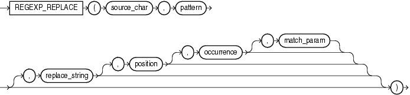

# REGEXP_REPLACE

## 语法



=== "用途"
    !!! note "用途"

        `REGEXP_REPLACE` 通过允许您在字符串中搜索正则表达式模式来扩展 `REPLACE` 函数的功能。默认情况下, 该函数返回 `source_char`, 并用 `replace_string` 替换正则表达式模式的每次出现。

=== "参数说明"
    !!! abstract annotate "参数"
    
        - `source_char` 是字符表达式, 用作搜索值。
        - `pattern` 是正则表达式。通常是一个文本字面量。
        - `replace_string` 是字符类型的值。`replace_string` 可以包含最多 500 个对子表达式的反向引用, 形式为 `\n`, 其中 `n` 是 1 到 9 之间的数字。如果要在 `replace_string` 中包含反斜杠(`\`), 则必须在前面加上转义字符, 也是一个反斜杠。
        - `position` 是一个正整数, 指示 Oracle 应开始搜索 `source_char` 的字符位置。默认为 1。 
        - `occurrence` 是一个非负整数, 指示替换操作的出现次数。 (1)
        - `match_param` 是 `VARCHAR2` 或 `CHAR` 数据类型的字符表达式, 它允许您更改函数的默认匹配行为。
    
    1.  - 如果指定 0, 则 Oracle 替换所有匹配项。这是默认值。
        - 如果指定一个正整数 `n`, 则 Oracle 替换第 `n` 次出现。
        - 如果 `occurrence` 大于 1, 则数据库从第一个 `pattern` 匹配后的第一个字符开始搜索第二次出现, 依此类推。

## 示例

用单个空格替换每个两个或多个空格的出现。

```sql
select regexp_replace('500   Oracle     Parkway,    Redwood  Shores, CA',
                      ' {2,}', ' ') "REGEXP_REPLACE"
from dual; -- (1)!
```

1.  !!! quote ""
        REGEXP_REPLACE
        --------------------------------------
        500 Oracle Parkway, Redwood Shores, CA


替换字符串中的所有数字,第一个出现的数字,第二个出现的数字:

```sql
select regexp_replace('a1b2c3', '[0-9]', '')       S1
     , regexp_replace('a1b2c3', '[0-9]', '', 1, 1) S2
     , regexp_replace('a1b2c3', '[0-9]', '', 1, 2) S3
from dual; -- (1)!
```

1.  !!! quote ""
        S1  S2    S3
        --- ----- -----
        abc ab2c3 a1bc3


用单个空格替换字符串中的连续空格:

```sql  
select regexp_replace('Hello World', ' {2,}', ' ') S1
     , regexp_replace('Hello        World', ' {2,}', ' ') S2
     , regexp_replace('Hello  World   !', ' {2,}', ' ') S3
from dual; -- (1)!
```

1.  !!! quote ""
        S1          S2          S3
        ----------- ----------- -------------
        Hello World Hello World Hello World !


用数字 8 替换字符串中所有字母:
```sql
select regexp_replace('abc123DEF6', '[a-z]', '8', 1, 0, 'i') STR
from dual; -- (1)!
```

1.  !!! quote ""
        STR
        ----------
        8881238886 


在字符串中的每个字符后面插入一个空格。

```sql
select regexp_replace('helloworld!', '(.)', '\1 ') REGEXP_REPLACE
from dual; -- (1)!
```

1.  !!! quote ""
        REGEXP_REPLACE
        ----------------------
        h e l l o w o r l d !


将 `xxx.xxx.xxxx` 模式的电话号码，使用 `(xxx) xxxx-xxx` 重新格式化。

```sql
select regexp_replace(phone_number,
                      '(\d{3})\.(\d{3})\.(\d{4})',
                      '(\1) \2-\3') REGEXP_REPLACE
from employees
order by REGEXP_REPLACE; -- (1)!
```

1.  !!! quote ""
        REGEXP_REPLACE
        --------------------------------------------------------------------------------
        (515) 123-4444
        (515) 123-4567
        (515) 123-4568
        (515) 123-4569
        (515) 123-5555
        . . .


将驼峰字符串转换为包含下划线分隔的小写单词的字符串:

```sql
with strings as (
    select 'AddressLine1' s from dual union all
    select 'ZipCode' s from dual union all
    select 'Country' s from dual  
)
select s                                                STRING
     , lower(regexp_replace(s, '([A-Z0-9])', '_\1', 2)) MODIFIED_STRING
from strings; -- (1)!
```

1.  !!! quote ""
        STRING               MODIFIED_STRING
        -------------------- --------------------
        AddressLine1         address_line_1
        ZipCode              zip_code
        Country              country


截取 HTML 第一个标签中的内容:

```sql
select regexp_replace('<h1>RegexLean</h1>',
                    '<(\w+)>(.*)</\1>', '\2') STR
from dual; -- (1)!
```

1.  !!! quote ""
        STR
        ---------
        RegexLean


将连续出现两次以上相同的单词字符替换为一个:

```sql
select regexp_replace('aabbcccDefg', '(\w)\1+', '\1') STR
from dual;  -- (1)!
```

1.  !!! quote ""
        STR
        -------
        abcDefg


