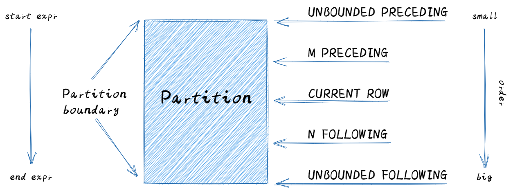

# 窗口函数

> 窗口函数又叫开窗函数、分析函数，也可以称为 OLAP 函数，OLAP 是 OnLine Analytical Processing 的简称，意思是对数据库数据进行实时分析处理。
>
> 窗口函数是对 where 或者 group by 子句处理后的结果进行操作, 窗口函数出现在 select 子句的表达式列表中(在 select 之前、having 之后执行)，它最显著的特点就是有 over 关键字


## 窗口函数与普通聚合函数的区别

- 聚合函数是将多条记录聚合为一条；窗口函数是每条记录都会执行，有几条记录执行完还是几条。

- 窗口函数兼具 GROUP BY 子句的分组功能以及 ORDER BY 子句的排序功能。但是，PARTITION BY 子句并不具备 GROUP BY 子句的汇总功能。


## 窗口函数解决的问题
- 组内比较/组内占比
- 累计求和
- TopN 问题/排名问题
- 连续性问题
- 同/环比问题


## 窗口函数的语法

```sql
function(arg1,..., argn) over([partition by <...>] [order by <....>] [<window_expression>])
```


### **function(arg1,..., argn) 可以是下面的函数：**

- Aggregate Functions: 聚合函数, 比如：`sum()`、` max()`、`min()`、`avg()` 等.

- Sort Functions: 数据排序函数, 比如 ：`rank()`、`row_number()` 等.

- Analytics Functions: 统计和比较函数, 比如：`lead()`、`lag()`、 `first_value()` 等.


### over([partition by <...>] [order by <....>]

> `partition by` 按照指定字段进行分区(分组)
>
> `order by` 将各个分区内的数据按照指定规则进行排序


### **window_expression 确定窗口边界**

> 窗口边界主要用于对 `partition by` 的分组结果做进一步限制，并定位出限制后的运算范围

**窗口边界常用关键字**

| 名词                | 含义         |
|:------------------- |:------------ |
| preceding           | 往前         |
| following           | 往后         |
| current row         | 当前行       |
| unbounded           | 起点         |
| unbounded preceding | 从前面的起点 |
| unbounded following | 到后面的终点 |

#### **窗口边界使用详解**



> 如果没有 `partition by` 子句 则不进行分区 或者说所有数据作为一个分区
>
> 如果没有 `order by` 子句 则不进行排序 (与顺序有关的函数要求必须具备 order by 子句)
>
> 如果没有 `order by` 子句 则默认窗口范围为 `rows between unbounded preceding and unbounded following` 即整个分区
>
> 如果有 `order by` 子句 则默认窗口范围为 `range between unbounded preceding and current row` 即分区内第一行的值到当前行的值 (值范围)


**`rows` 和 `range` 的区别**

> `rows` 表示的是行 
>
> `range` 表示的是值 


## **窗口函数的计算过程（语法中每个部分都是可选的）**

- 按窗口定义，将所有输入数据分区、再排序（如果需要的话）
- 对每一行数据，计算它的窗口范围
- 将窗口内的行集合输入窗口函数，计算结果填入当前行


## 窗口函数的分类

### **窗口聚合函数**

| 函数    | 说明     |
| :------ | :------- |
| sum()   | 求和     |
| avg()   | 求平均值 |
| max()   | 求最大值 |
| min()   | 求最小值 |
| count() | 计数     |

> 大多数聚合函数都可以加上 over()I子句用作窗口函数 具体支持可自行验证
>
> 聚合函数用作窗口函数时也会忽略 null 值

#### **排名窗口函数**

| 函数           | 说明                                                         |
| :------------- | :----------------------------------------------------------- |
| row_number()   | 排名,序号连续,同值不同号  如: 1 2 3 4 5                      |
| rank()         | 排名,序号可能不连续,同值同号,下一个会跳号排序  如: 1 2 2 4 5 |
| dense_rank()   | dense_rank 函数的功能与 rank 函数类似，dense_rank 函数在生成序号时是连续的，而 rank 函数生成的序号有可能不连续。当出现名次相同时，则排名序号也相同。而下一个排名的序号与上一个排名序号是连续的。 |
| percent_rank() | 计算给定行的百分比排名。可以用来计算超过了百分之多少的人; 排名计算公式为：(当前行的 rank 值-1)/(分组内的总行数-1) |
| cume_dist()    | 计算某个窗口或分区中某个值的累积分布。假定升序排序，则使用以下公式确定累积分布：小于等于当前值 x 的行数 / 窗口或 partition 分区内的总行数。其中，x 等于 order by 子句中指定的列的当前行中的值 |
| ntile()        | 已排序的行划分为大小尽可能相等的指定数量的排名的组，并返回给定行所在的组的排名。如果切片不均匀，默认增加第一个切片的分布，不支持 ROWS BETWEEN |


### **值窗口函数**

| 窗口函数      | 函数功能说明                                                 |
| :------------ | :----------------------------------------------------------- |
| lag()         | 与 lead 相反，用于统计窗口内往上第 n 行值。第一个参数为列名，第二个参数为往上第 n 行（可选，默认为 1），第三个参数为默认值（当往上第 n 行为 NULL 时候，取默认值，如不指定，则为 NULL. |
| lead()        | 用于统计窗口内往下第 n 行值。第一个参数为列名，第二个参数为往下第 n 行（可选，默认为 1），第三个参数为默认值（当往下第 n 行为 NULL 时候，取默认值，如不指定，则为 NULL. |
| first_value() | 取分组内排序后，截止到当前行，第一个值                       |
| last_value()  | 取分组内排序后，截止到当前行，最后一个值                     |
| nth_value()   |                                                              |


### **使用窗口函数实现环比计算**

> 什么是环比、什么是同比？
>
> 与上年度数据对比称 "同比"，与上月数据对比称 "环比"
>
> 相关公式如下: 同比增长率计算公式：(当年值-上年值)/上年值 x100%
>
> 环比增长率计算公式：(当月值-上月值)/上月值 x100%


